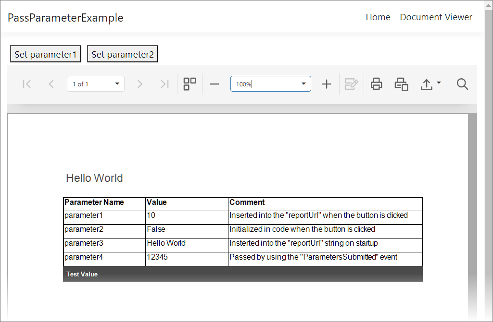

<!-- default badges list -->

<!-- default badges end -->
# Reporting for Angular - Pass Parameters from the Angular Client to a Report

This example demonstrates how to send parameters from the client side to the report displayed in the Document Viewer.

The first method constructs the report URL that includes the parameter as a query string and uses this URL to open a report. The report's URL is passed to the [ReportStorageWebExtension.GetData](https://docs.devexpress.com/XtraReports/DevExpress.XtraReports.Web.Extensions.ReportStorageWebExtension.GetData(System.String)) method at the server. You can implement and register a custom storage with the **GetData** method that parses the URL string, extracts the parameter values, creates a report, sets the report parameters and returns the report to the sender.

Another method uses the client-side [JSReportViewer.GetParametersModel](https://docs.devexpress.com/XtraReports/js-DevExpress.Reporting.Viewer.JSReportViewer.GetParametersModel) method that provides access to the report parameter model. When parameters are modified, a call to the [JSReportViewer.StartBuild](https://docs.devexpress.com/XtraReports/js-DevExpress.Reporting.Viewer.JSReportViewer.StartBuild) method is required to rebuild the document.

The sample application includes two buttons to show the methods described above. The JavaScript function hides the Document Viewer's side panel and sets the zoom to 100%. 

## Files to Review

- [report-viewer.ts](PassParameterExample/ClientApp/src/app/reportviewer/report-viewer.ts)
- [report-viewer.html](PassParameterExample/ClientApp/src/app/reportviewer/report-viewer.html)
- [CustomReportStorageWebExtension.cs](PassParameterExample/Services/CustomReportStorageWebExtension.cs)
- [ReportsFactory.cs](PassParameterExample/PredefinedReports/ReportsFactory.cs)
- [Startup.cs](PassParameterExample/Startup.cs)

## Documentation

- [Use Report Parameters](https://docs.devexpress.com/XtraReports/4812/detailed-guide-to-devexpress-reporting/use-report-parameters)
- [Report Parameters in ASP.NET Core Applications](https://docs.devexpress.com/XtraReports/403203/web-reporting/asp-net-core-reporting/report-parameters-in-asp-net-core-applications)
- [Reporting for Angular](https://docs.devexpress.com/XtraReports/401914/web-reporting/javascript-reporting/angular)

## More Examples

- [Reporting for ASP.NET Core - Custom Report Parameter Types](https://github.com/DevExpress-Examples/Reporting-Custom-Parameter-Editor-AspNet-Core)
- [Reporting for ASP.NET MVC - Custom Report Parameter Types](https://github.com/DevExpress-Examples/Reporting-Custom-Parameter-Editor-Mvc)
